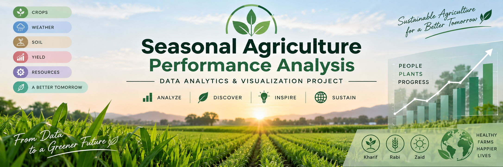

# Seasonal Agriculture Performance Analysis

## Project Overview

This project analyzes agricultural performance across different seasons using data analytics and visualization techniques.

The analysis focuses on identifying seasonal patterns, differences, relationships and variations in agricultural performance.

## Objectives

- Explore and understand the agricultural dataset
- Clean and prepare the data
- Analyze agricultural performance across seasons
- Identify seasonal patterns and trends
- Study relationships between environmental conditions and agricultural outcomes
- Compare crops and regions across seasons
- Analyze resource usage and economic performance
- Develop evidence-based insights and recommendations

## Dataset

The dataset contains information related to:

- Farm and geographical details
- Crops and seasons
- Environmental conditions
- Soil characteristics
- Agricultural inputs
- Irrigation methods
- Crop yield and production
- Revenue, cost and profit
- Water usage and efficiency
- Disease and pest risk

## Technologies Used

- Python
- Pandas
- NumPy
- Matplotlib
- Seaborn
- SciPy
- Google Colab / Jupyter Notebook

## Key Findings

- Kharif shows the strongest overall agricultural performance.
- Kharif has the highest average yield, production, revenue and profit.
- Zaid shows comparatively lower yield and production.
- Zaid records negative average profit.
- Environmental conditions vary significantly across seasons.
- Resource usage also differs across seasons.
- Correlation analysis identifies relationships between environmental factors, resources and agricultural performance.

## Project Files

- `Seasonal_Agriculture_Performance_Major_Project.ipynb` – Project analysis notebook
- `seasonal_agriculture_performance_dataset.xlsx` – Dataset
- `Seasonal_Agriculture_Performance_Project_Presentation.pptx` – Project presentation

## Conclusion

Seasonal conditions influence agricultural performance, and the analysis provides evidence-based insights that can support better seasonal agricultural planning and resource management.
